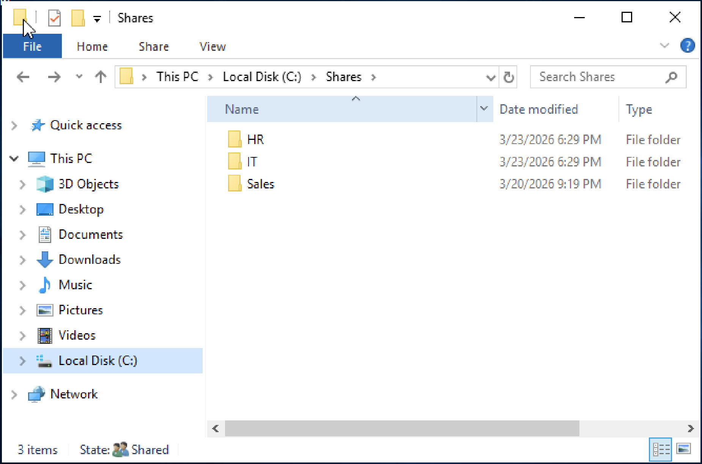
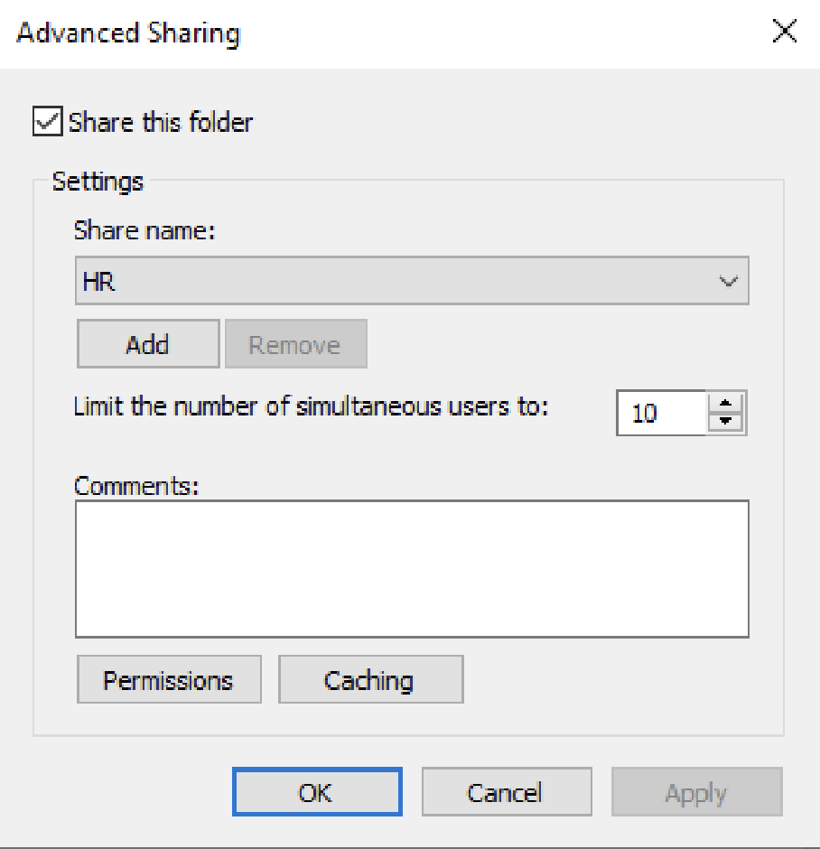
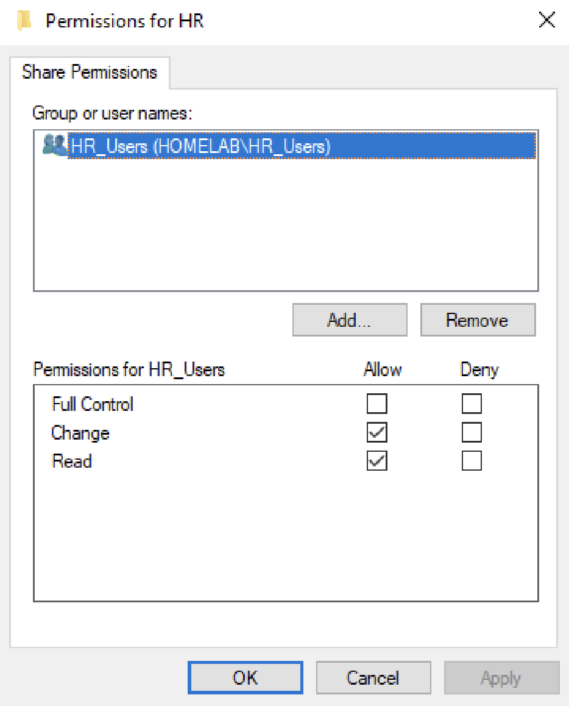
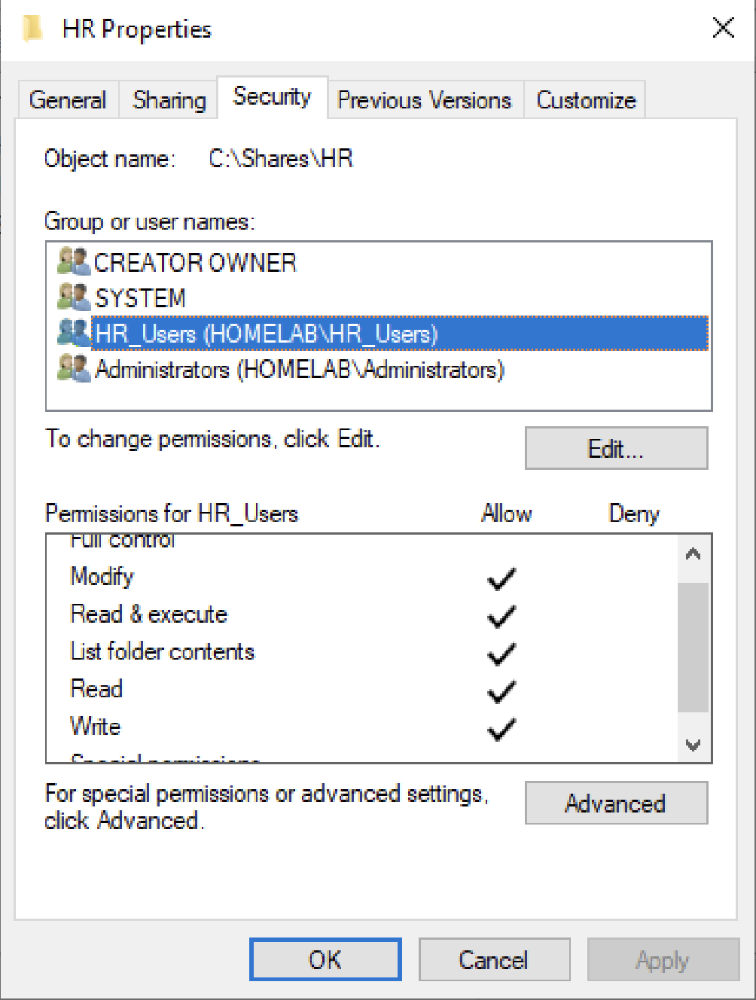
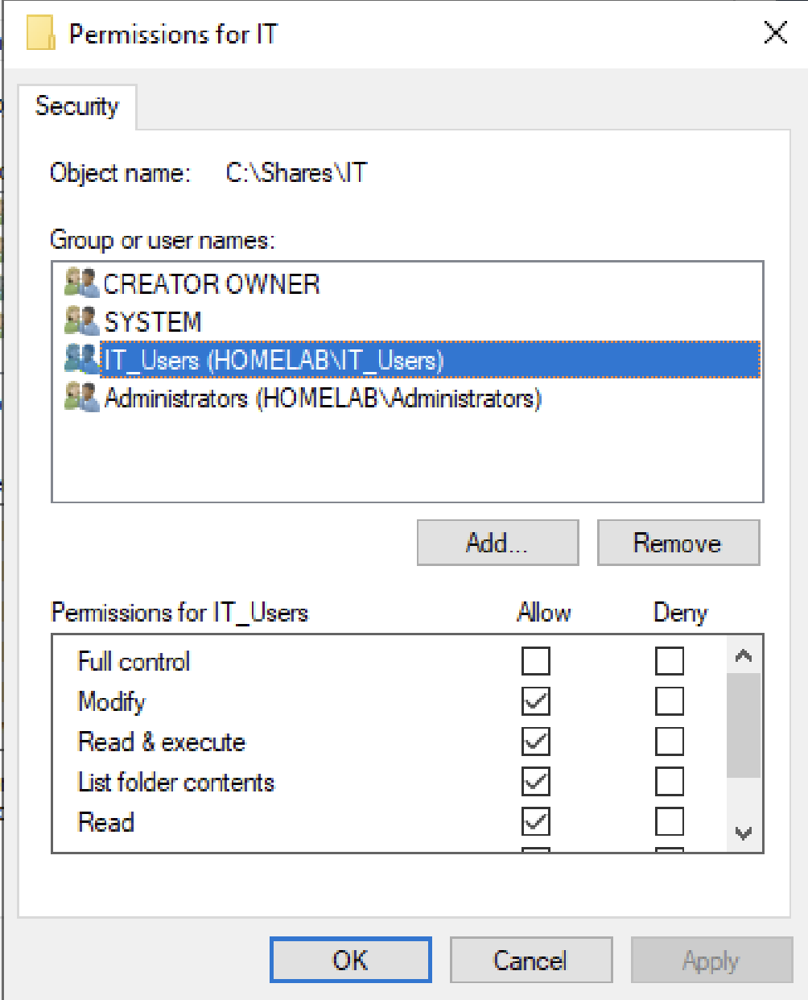
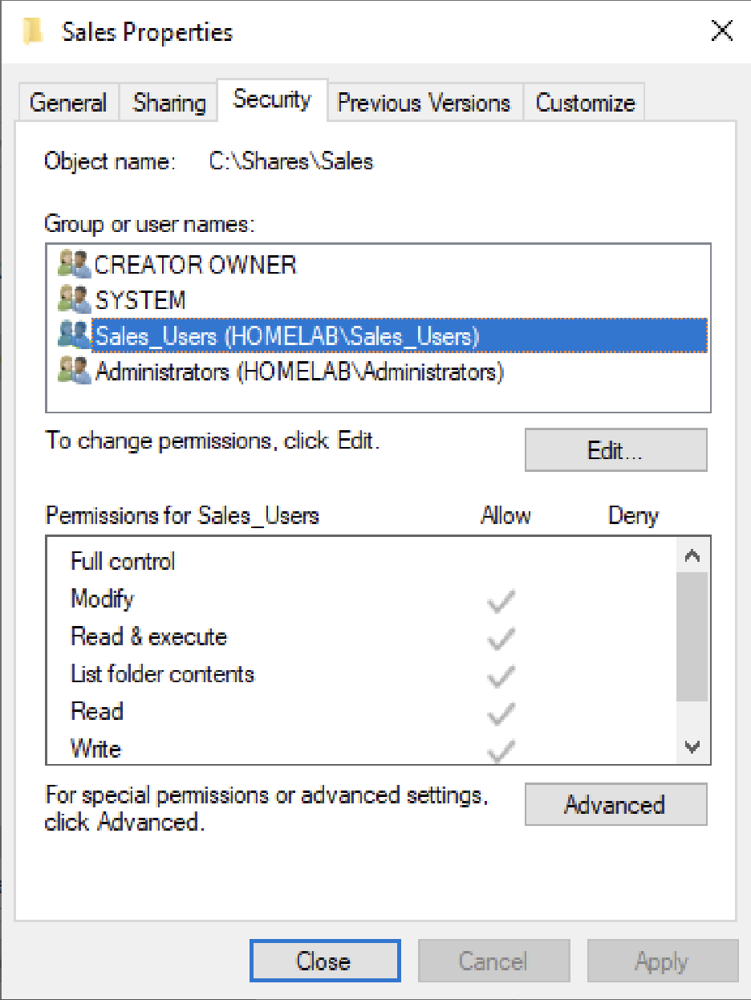
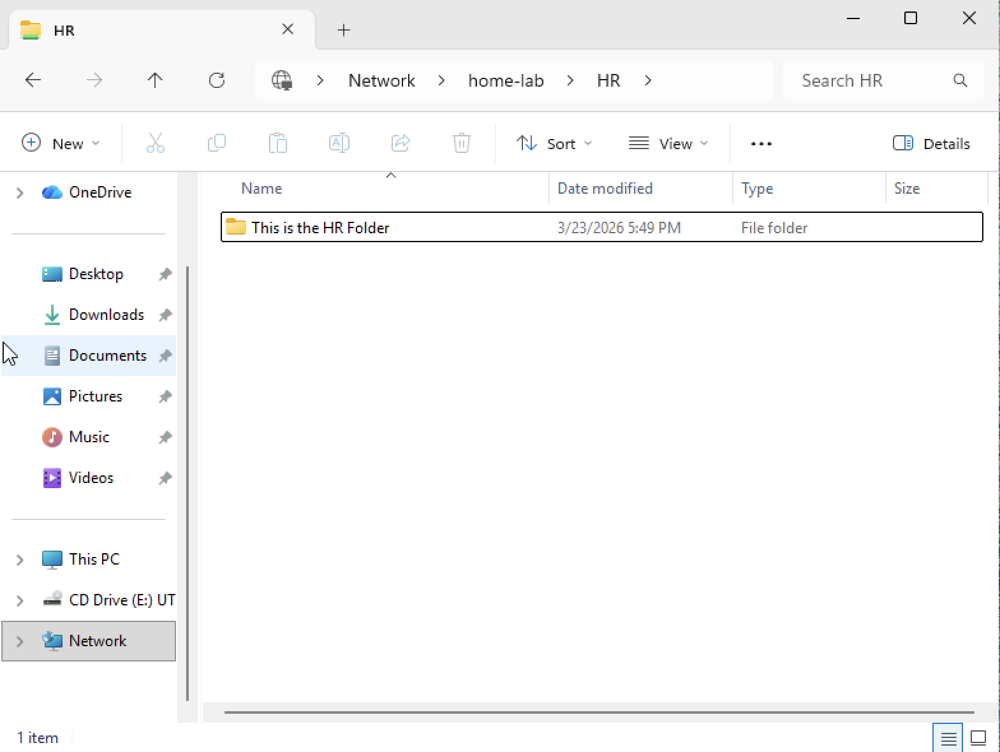
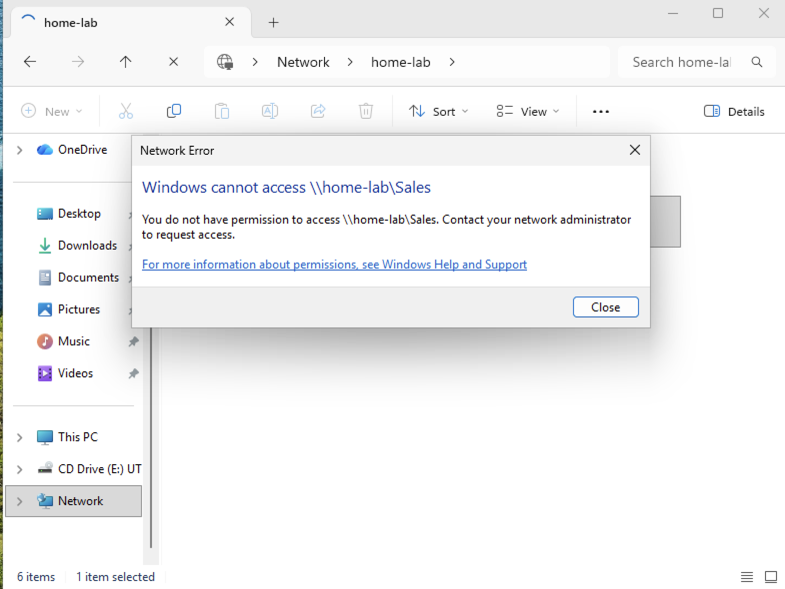

# NTFS + Share Permissions Lab

## Objective
Configure shared folders in a Windows Server environment and implement access control using Share and NTFS permissions. Validate access based on Active Directory group membership.

---

## Lab Environment

- Windows Server 2019 Virtual Machine
- Windows 11 Pro Virtual Manchine (domian-joined client)
- Active Directory Domain Services (AD DS)  
- Active Directory Users and Computers (ADUC)

---

## Skills Demonstrated

- File share configuration  
- NTFS permission management  
- Active Directory group-based access control  
- Access validation and troubleshooting  
- Understanding Share vs NTFS permission interaction  

---

## Step-by-Step Configuration

### 1. Created Folder Structure

Created a centralized directory for departmental shares.

**Folders:**
- C:\Shares\HR  
- C:\Shares\IT  
- C:\Shares\Sales  
  

---

### 2. Configured Share Permissions (HR)

Shared the HR folder and assigned permissions to the HR security group in Advance Sharing option. Configured permissions to Change and Read.
  

  

---

### 3. Configured NTFS Permissions (HR)

Configured file system permissions for the HR folder in the Security tab. Removed unwanted groups and added HR_Users. Assigned permissions Modify, Read & Execute, List folder contents, Read and Write to the HR_Users group.
  

---

### 4. Configured IT and Sales Folders

Applied the same process to additional departments (IT and Sales) to their designated folder. Assigned permissions Modify, Read & Execute, List folder contents, Read and Write.
  

  

---

### 5. Validated Access from Client Machine

Tested access using an HR user on the HR folder and Sales folder. HR folder access was granted but Sales folder was denied due to permissions.

Authorized access (HR user → HR folder)  

Access denied (HR user → IT/Sales folders)  

---

## Key Takeaways

- Share permissions control access over the network, while NTFS permissions control access at the file system level  
- The most restrictive permission between Share and NTFS determines final access  
- Assigning permissions to security groups instead of individual users improves scalability and management  
- Group-based access control simplifies administration and aligns with real-world best practices  
- Proper permission configuration ensures users can only access resources relevant to their role